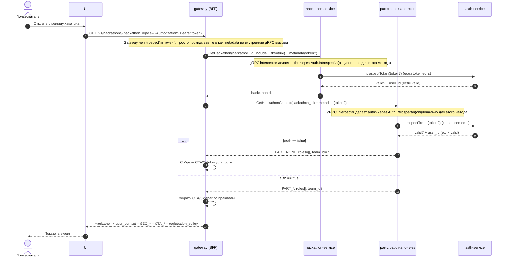

# UC-HX-01 — Открыть страницу хакатона и получить корректные CTA/Sidebar

## Зачем нужен юзкейс
Пользователь открывает страницу конкретного хакатона и должен увидеть корректные разделы слева (`SEC_*`) и набор основных действий (`CTA_*`) в зависимости от того, залогинен ли он, зарегистрирован ли на хакатон (`PART_*`) и какие у него хакатонные роли (`HX_ROLE_*`). Это позволяет фронту не дублировать правила показа кнопок и секций.

---

## Участники
- Гость (не залогинен)
- Пользователь (залогинен)
- Участник хакатона (имеет `PART_*`)
- Оргсостав (имеет `HX_ROLE_*`)

---

## Триггер
Открытие страницы хакатона.

---

## Эндпоинт (BFF)
- `GET /v1/hackathons/{hackathon_id}/view`

> BFF-ручка публичная: должна работать и для гостя.  
> Gateway **не делает introspect** токена и **не принимает решений** по доступу; он просто прокидывает токен дальше во внутренние gRPC вызовы.

---

## Что возвращаем
- Данные хакатона для главной страницы: название, краткое описание, описание, локация, даты/окна, этап (`stage`), теги, ссылки.
- Контекст пользователя в хакатоне (если залогинен): `PART_*`, идентификатор команды (если есть), `HX_ROLE_*`.
- Список `SEC_*`.
- Список `CTA_*`.
- Политика регистрации (REG_ALLOW_INDIVIDUAL, REG_ALLOW_TEAM).

---

## Аутентификация / авторизация (принцип)
- Gateway/BFF **прокидывает `Authorization: Bearer <token>`** (если он есть) во внутренние gRPC вызовы.
- Каждый внутренний сервис (hackathon-service, participation-and-roles) сам выполняет **authn** через свой gRPC interceptor (через Auth-service introspect).
- Для этого юзкейса все внутренние методы, которые вызываются из BFF, считаются **public/optional-auth**:
  - если токен валиден → сервис видит `user_id` в ctx и отдаёт user-specific данные
  - если токена нет/он невалиден → сервис работает как для гостя (не падает в 401), возвращает “пустой/guest” контекст

---

## Правила формирования CTA
| Условие | Возвращаемые `CTA_*` |
|---|---|
| `auth == false` | `CTA_SIGNUP_OR_LOGIN` |
| `auth == true AND PART_* == PART_NONE` | `CTA_REGISTER` |
| `auth == true AND (PART_* == PART_INDIVIDUAL_ACTIVE OR PART_* == PART_LOOKING_FOR_TEAM OR PART_* == PART_TEAM_MEMBER OR PART_* == PART_TEAM_CAPTAIN)` | `CTA_OPEN_ME_IN_HACKATHON` |
| `auth == true AND (PART_* == PART_INDIVIDUAL_ACTIVE OR PART_* == PART_TEAM_MEMBER OR PART_* == PART_TEAM_CAPTAIN)` | `CTA_OPEN_CHALLENGE` |
| `auth == true AND (HAS(HX_ROLE_OWNER) OR HAS(HX_ROLE_ORGANIZER))` | `CTA_OPEN_ORGANIZER` |
| `auth == true AND HAS(HX_ROLE_MENTOR)` | `CTA_OPEN_MENTOR` |
| `auth == true AND HAS(HX_ROLE_JUDGE)` | `CTA_OPEN_JUDGE` |

---

## Правила формирования Sidebar
| Условие | Возвращаемые `SEC_*` |
|---|---|
| `true` | `SEC_MAIN` |
| `auth == true AND (PART_* == PART_INDIVIDUAL_ACTIVE OR PART_* == PART_LOOKING_FOR_TEAM OR PART_* == PART_TEAM_MEMBER OR PART_* == PART_TEAM_CAPTAIN)` | `SEC_ME_IN_HACKATHON` |
| `auth == true AND ((PART_* == PART_INDIVIDUAL_ACTIVE OR PART_* == PART_TEAM_MEMBER OR PART_* == PART_TEAM_CAPTAIN) OR HAS(HX_ROLE_OWNER) OR HAS(HX_ROLE_ORGANIZER))` | `SEC_CHALLENGE_SUBMIT` |
| `auth == true AND (HAS(HX_ROLE_OWNER) OR HAS(HX_ROLE_ORGANIZER))` | `SEC_ORGANIZER` |
| `auth == true AND HAS(HX_ROLE_MENTOR)` | `SEC_MENTOR` |
| `auth == true AND HAS(HX_ROLE_JUDGE)` | `SEC_JUDGE` |

---

## Правила экрана регистрации (какие варианты показать после `CTA_REGISTER`)
| Условие | Показать варианты регистрации |
|---|---|
| `REG_ALLOW_INDIVIDUAL == true AND REG_ALLOW_TEAM == true` | `PART_INDIVIDUAL_ACTIVE`, `PART_TEAM_CAPTAIN`, `PART_LOOKING_FOR_TEAM` |
| `REG_ALLOW_INDIVIDUAL == true AND REG_ALLOW_TEAM == false` | `PART_INDIVIDUAL_ACTIVE` |
| `REG_ALLOW_INDIVIDUAL == false AND REG_ALLOW_TEAM == true` | `PART_TEAM_CAPTAIN`, `PART_LOOKING_FOR_TEAM` |

---

## Sequence

