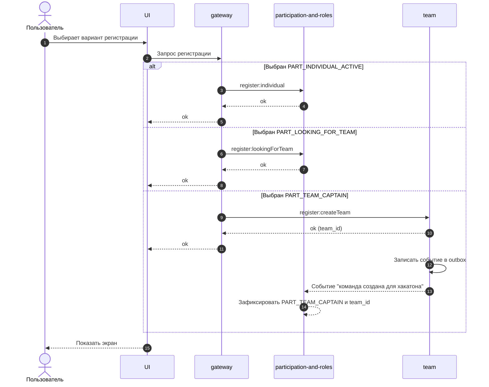

# UC-HX-02 — Регистрация на хакатон (выбор режима участия)

## Зачем нужен юзкейс
Пользователь, у которого нет участия в хакатоне (`PART_NONE`), должен зарегистрироваться в одном из разрешённых режимов. Результат регистрации фиксирует состояние участия (`PART_*`) и создаёт “профиль участника хакатона” для матчмейкинга (текст + желаемые роли). Это определяет доступ к разделам `SEC_*` и действиям `CTA_*` в дальнейших юзкейсах.

---

## Участники
- Пользователь (залогинен)

---

## Триггер
Пользователь нажимает `CTA_REGISTER` и выбирает вариант регистрации на экране регистрации.

---

## Предусловия
- `auth == true`
- `PART_* == PART_NONE`

---

## Эндпоинты
- `POST /v1/hackathons/{hackathon_id}/register:individual`
- `POST /v1/hackathons/{hackathon_id}/register:lookingForTeam`
- `POST /v1/hackathons/{hackathon_id}/register:createTeam`

---

## Что возвращаем
- Обновлённый контекст пользователя в хакатоне: новый `PART_*` и `team_id` (если появился).

---

## Правила экрана регистрации (какие варианты показать после `CTA_REGISTER`)
| Условие | Показать варианты регистрации |
|---|---|
| `REG_ALLOW_INDIVIDUAL == true AND REG_ALLOW_TEAM == true` | `PART_INDIVIDUAL_ACTIVE`, `PART_TEAM_CAPTAIN`, `PART_LOOKING_FOR_TEAM` |
| `REG_ALLOW_INDIVIDUAL == true AND REG_ALLOW_TEAM == false` | `PART_INDIVIDUAL_ACTIVE` |
| `REG_ALLOW_INDIVIDUAL == false AND REG_ALLOW_TEAM == true` | `PART_TEAM_CAPTAIN`, `PART_LOOKING_FOR_TEAM` |

---

## Правила обработки выбора варианта (результирующий `PART_*`)
| Условие | Действие пользователя | Результат (`PART_*`) |
|---|---|---|
| `REG_ALLOW_INDIVIDUAL == true AND PART_* == PART_NONE` | Выбирает индивидуальную регистрацию (`register:individual`) | `PART_INDIVIDUAL_ACTIVE` |
| `REG_ALLOW_TEAM == true AND PART_* == PART_NONE` | Выбирает “зарегистрироваться и найти команду позже” (`register:lookingForTeam`) | `PART_LOOKING_FOR_TEAM` |
| `REG_ALLOW_TEAM == true AND PART_* == PART_NONE` | Выбирает “создать команду” (`register:createTeam`) | `PART_TEAM_CAPTAIN` |

---

