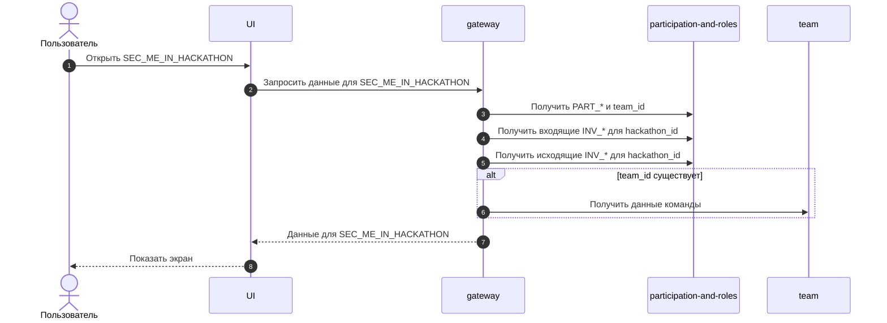

# UC-HX-03 — Раздел `SEC_ME_IN_HACKATHON` (просмотр моего статуса и действий в хакатоне)

## Зачем нужен юзкейс
Участник хакатона открывает раздел `SEC_ME_IN_HACKATHON`, чтобы увидеть свой текущий статус участия (`PART_*`), связанную команду (если она есть), а также входящие/исходящие запросы и приглашения (`INV_*`). Это единая точка “что со мной в хакатоне происходит” и главный экран для действий вокруг команды и матчмейкинга.

---

## Участники
- Пользователь (залогинен и имеет участие в хакатоне)

---

## Триггер
Пользователь открывает раздел `SEC_ME_IN_HACKATHON` (или нажимает `CTA_OPEN_ME_IN_HACKATHON`).

---

## Предусловия
- `auth == true`
- `PART_* == PART_INDIVIDUAL_ACTIVE OR PART_* == PART_LOOKING_FOR_TEAM OR PART_* == PART_TEAM_MEMBER OR PART_* == PART_TEAM_CAPTAIN`

---

## Эндпоинт
- `GET /v1/hackathons/{hackathon_id}/me`

---

## Что возвращаем
- `PART_*`
- `team_id` (если есть)
- Списки запросов/приглашений:
  - входящие (к пользователю) `INV_*` со статусами `INV_*`
  - исходящие (от пользователя) `INV_*` со статусами `INV_*`
- Блок команды (если есть `team_id`): данные команды и состав

---

## Правила наполнения экрана
| Условие | Что показываем пользователю |
|---|---|
| `PART_* == PART_INDIVIDUAL_ACTIVE` | Профиль участия + поиск команды + возможность создать `INV_TEAM_JOIN_REQUEST` |
| `PART_* == PART_LOOKING_FOR_TEAM` | Профиль участия + поиск команды + возможность создать `INV_TEAM_JOIN_REQUEST` + напоминание о дедлайне |
| `PART_* == PART_TEAM_MEMBER` | Профиль участия + команда + возможность выйти из команды |
| `PART_* == PART_TEAM_CAPTAIN` | Профиль участия + команда + управление командой (редактирование/вакансии/приглашения/transfer captain) |

---

