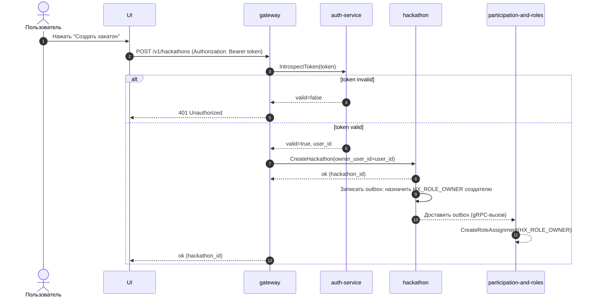

# UC-HX-17 — Создать хакатон

## Зачем нужен юзкейс
Залогиненный пользователь создаёт новый хакатон, чтобы затем заполнить его данные и управлять им. Создатель должен получить роль `HX_ROLE_OWNER`, чтобы видеть `SEC_ORGANIZER` и иметь права на управление хакатоном.

---

## Участники
- Пользователь (залогинен)
- Gateway (HTTP API)
- Auth Service (introspect)
- Hackathon Service
- Participation&Roles Service

---

## Триггер
Пользователь нажимает “Создать хакатон” в листинге.

---

## Предусловия
- Пользователь отправляет запрос с `Authorization: Bearer <token>`.

---

## Авторизация (обязательное правило)
Эндпоинт защищён авторизацией на уровне gateway:
- перед выполнением handler’а gateway обязан провалидировать токен через `AuthService.IntrospectToken`
- если токен невалиден/истёк/неподдерживаемый — запрос отклоняется до вызова доменных сервисов

---

## Эндпоинт
- `POST /v1/hackathons`

---

## Что возвращаем
- `hackathon_id` (uuid)

---

## Правила
| Условие | Результат |
|---|---|
| `AuthService.IntrospectToken` вернул `valid == false` | `401 Unauthorized`, доменные сервисы не вызываются |
| `AuthService.IntrospectToken` вернул `valid == true` | Создаётся новый хакатон |
| Хакатон создан | Создателю назначается роль `HX_ROLE_OWNER` через outbox hackathon-service (асинхронно) |

---

## Sequence

