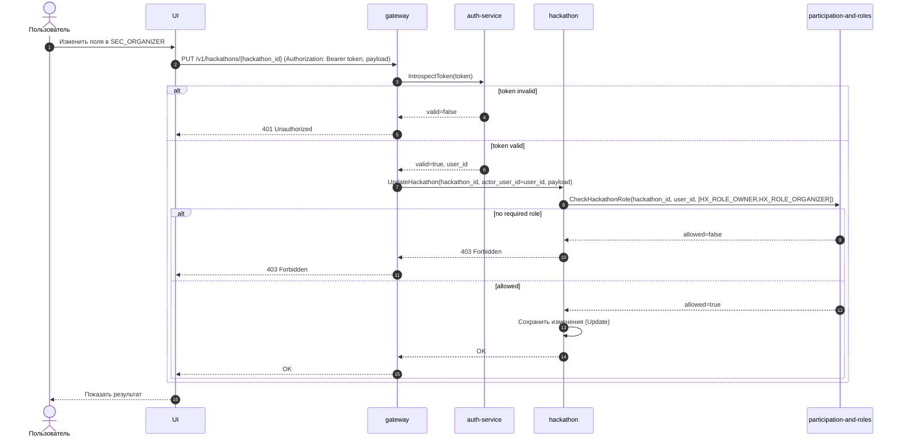

# UC-HX-18 — Редактировать хакатон (основные поля)

## Зачем нужен юзкейс
`HX_ROLE_OWNER` или `HX_ROLE_ORGANIZER` меняет основные данные хакатона, чтобы подготовить его к публикации и управлять регистрацией (в том числе через `REG_ALLOW_INDIVIDUAL` и `REG_ALLOW_TEAM`).

---

## Участники
- Пользователь (залогинен)
- Gateway (HTTP API)
- Auth Service (introspect)
- Hackathon Service
- Participation&Roles Service

---

## Триггер
Пользователь открывает `SEC_ORGANIZER` и сохраняет изменения.

---

## Предусловия
- Пользователь отправляет запрос с `Authorization: Bearer <token>`.

---

## Авторизация (обязательное правило)
Эндпоинт защищён авторизацией на уровне gateway:
- перед выполнением handler’а gateway обязан провалидировать токен через `AuthService.IntrospectToken`
- если токен невалиден/истёк/неподдерживаемый — запрос отклоняется до вызова доменных сервисов

---

## Эндпоинт
- `PUT /v1/hackathons/{hackathon_id}`

---

## Что возвращаем
- `OK` (успешное сохранение)

---

## Правила
| Условие | Результат |
|---|---|
| `AuthService.IntrospectToken` вернул `valid == false` | `401 Unauthorized`, доменные сервисы не вызываются |
| `valid == true` и `HAS(HX_ROLE_OWNER) OR HAS(HX_ROLE_ORGANIZER)` | Изменения сохраняются |
| `valid == true` и `NOT HAS(HX_ROLE_OWNER) AND NOT HAS(HX_ROLE_ORGANIZER)` | `403 Forbidden` |

> Важно: проверка ролей выполняется **внутри hackathon-service**, а не в gateway.

---

## Sequence

