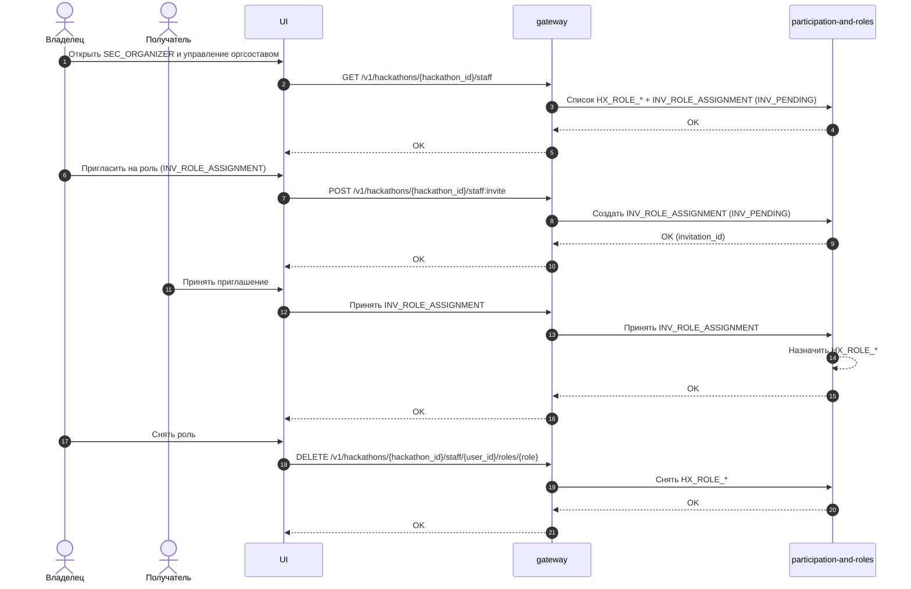

# UC-HX-19 — Управление оргсоставом хакатона (пригласить/удалить/изменить роли)

## Зачем нужен юзкейс
Владелец хакатона (`HX_ROLE_OWNER`) управляет оргсоставом: назначает и снимает роли `HX_ROLE_ORGANIZER`, `HX_ROLE_MENTOR`, `HX_ROLE_JUDGE`. Назначение роли происходит через единый механизм приглашений (`INV_ROLE_ASSIGNMENT`), чтобы роль появлялась только после принятия приглашения.

---

## Участники
- Владелец хакатона (залогинен, имеет `HX_ROLE_OWNER`)
- Получатель приглашения (залогинен)

---

## Триггер
Владелец открывает `SEC_ORGANIZER` и управляет оргсоставом (добавить роль / убрать роль / посмотреть список).

---

## Предусловия
- `auth == true`
- `HAS(HX_ROLE_OWNER)`

---

## Эндпоинты
- `GET /v1/hackathons/{hackathon_id}/staff`
- `POST /v1/hackathons/{hackathon_id}/staff:invite`
- `DELETE /v1/hackathons/{hackathon_id}/staff/{user_id}/roles/{role}`

---

## Что возвращаем
- Для `GET`: список пользователей оргсостава и их роли `HX_ROLE_*`, включая ожидающие назначения (через `INV_ROLE_ASSIGNMENT` со статусом `INV_PENDING`).
- Для `POST`: uuid созданного приглашения.
- Для `DELETE`: подтверждение удаления роли.

---

## Правила
| Условие | Результат |
|---|---|
| `auth == true AND HAS(HX_ROLE_OWNER)` | Разрешено управлять оргсоставом. |
| `auth == true AND NOT HAS(HX_ROLE_OWNER)` | Доступ запрещён. |
| `POST staff:invite` | Создаётся `INV_ROLE_ASSIGNMENT` со статусом `INV_PENDING`. |
| `INV_ROLE_ASSIGNMENT` принят получателем | Назначается соответствующая роль `HX_ROLE_*` получателю. |
| `DELETE role` | Роль снимается сразу (без приглашения). |

---

