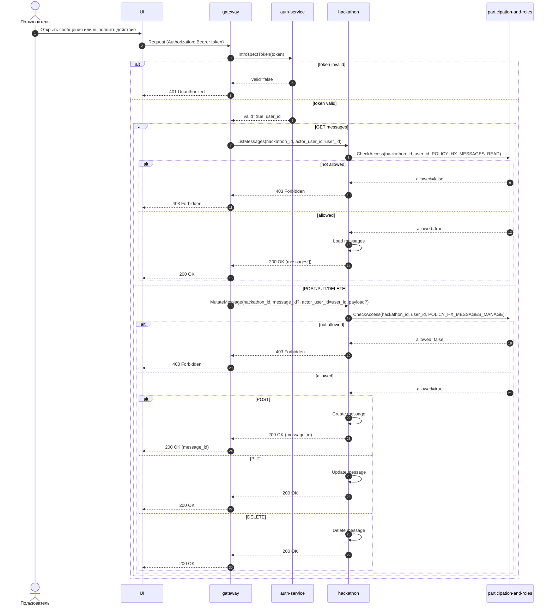

# UC-HX-20 — Сообщения организаторов (список для участников и оргсостава, управление для организаторов)

## Зачем нужен юзкейс
Сообщения организаторов — это объявления и уточнения по хакатону. Их могут читать участники хакатона и оргсостав, а создавать/редактировать/удалять — только `HX_ROLE_OWNER` и `HX_ROLE_ORGANIZER`.

---

## Участники
- Пользователь (залогинен)
- Gateway (HTTP API)
- Auth Service (introspect)
- Hackathon Service
- Participation&Roles Service (policy engine)

---

## Триггер
Пользователь открывает список сообщений, либо (если имеет права) управляет сообщениями.

---

## Предусловия
- Пользователь отправляет запрос с `Authorization: Bearer <token>`.

---

## Авторизация (обязательное правило)
Все эндпоинты ниже защищены авторизацией на уровне gateway:
- перед выполнением handler’а gateway обязан провалидировать токен через `AuthService.IntrospectToken`
- если токен невалиден/истёк/неподдерживаемый — запрос отклоняется до вызова доменных сервисов

---

## Эндпоинты
- `GET /v1/hackathons/{hackathon_id}/messages`
- `POST /v1/hackathons/{hackathon_id}/messages`
- `PUT /v1/hackathons/{hackathon_id}/messages/{message_id}`
- `DELETE /v1/hackathons/{hackathon_id}/messages/{message_id}`

---

## Что возвращаем
- Для `GET`: список сообщений.
- Для `POST`: uuid созданного сообщения.
- Для `PUT`: `OK` (успешное сохранение).
- Для `DELETE`: `OK` (успешное удаление).

---

## Политики доступа (Participation&Roles)

| Policy | Смысл |
|---|---|
| `POLICY_HX_MESSAGES_READ` | `PART_* != PART_NONE OR HX_ROLE ∈ {OWNER, ORGANIZER, MENTOR, JUDGE}` |
| `POLICY_HX_MESSAGES_MANAGE` | `HX_ROLE ∈ {OWNER, ORGANIZER}` |

---

## Правила доступа

### Чтение списка (`GET`)
| Условие | Результат |
|---|---|
| `AuthService.IntrospectToken` → `valid == false` | `401 Unauthorized`, доменные сервисы не вызываются |
| `valid == true` и `CheckAccess(POLICY_HX_MESSAGES_READ) == true` | Разрешено читать список сообщений |
| `valid == true` и `CheckAccess(POLICY_HX_MESSAGES_READ) == false` | `403 Forbidden` |

### Управление (`POST/PUT/DELETE`)
| Условие | Результат |
|---|---|
| `AuthService.IntrospectToken` → `valid == false` | `401 Unauthorized`, доменные сервисы не вызываются |
| `valid == true` и `CheckAccess(POLICY_HX_MESSAGES_MANAGE) == true` | Разрешено создавать/редактировать/удалять |
| `valid == true` и `CheckAccess(POLICY_HX_MESSAGES_MANAGE) == false` | `403 Forbidden` |

---

## Sequence

